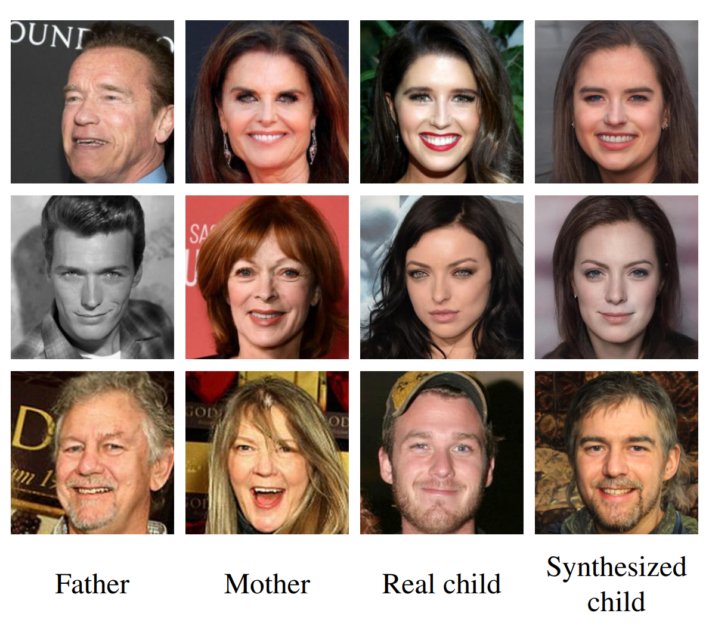
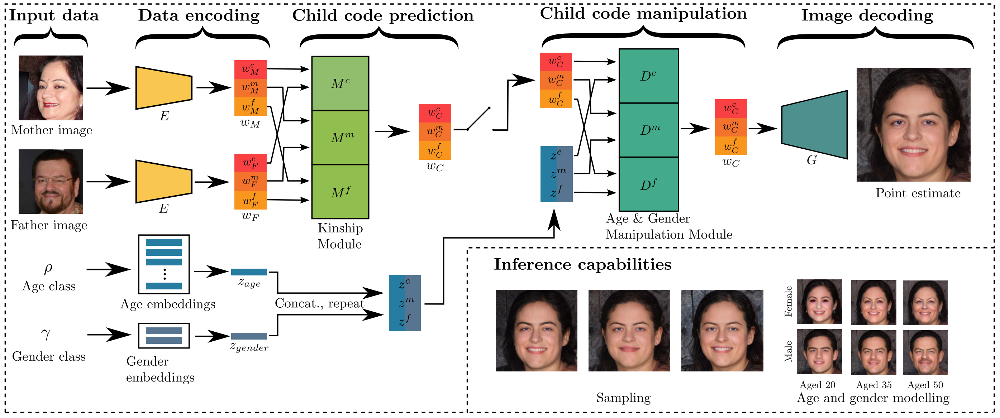
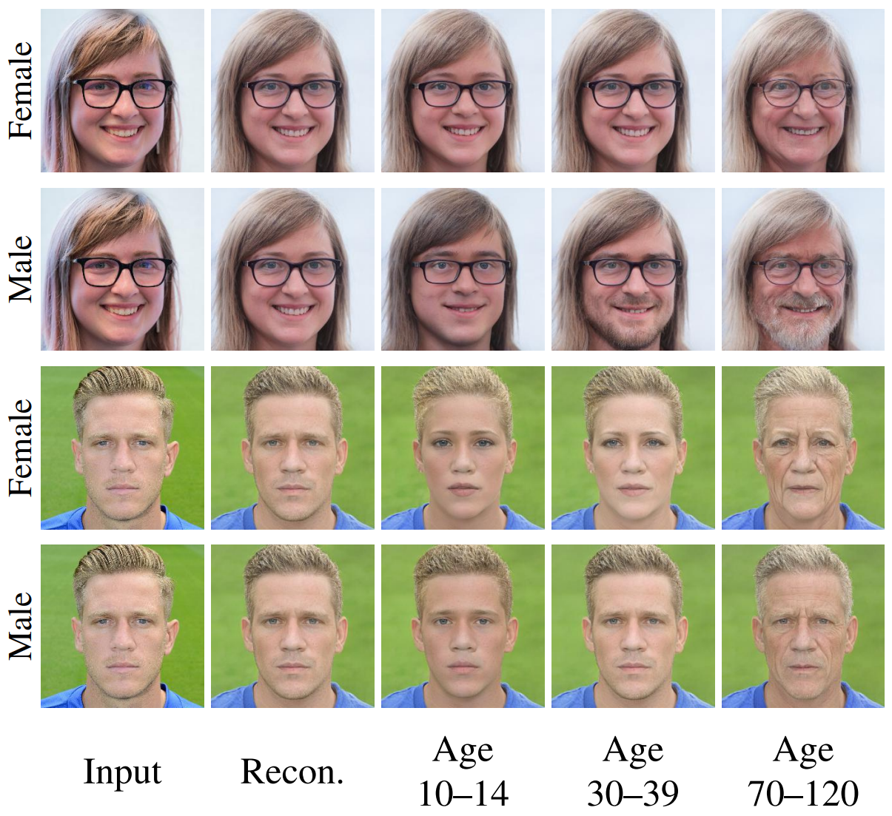
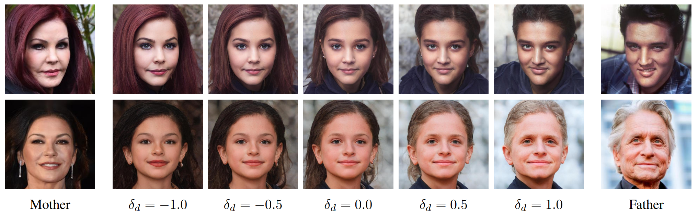
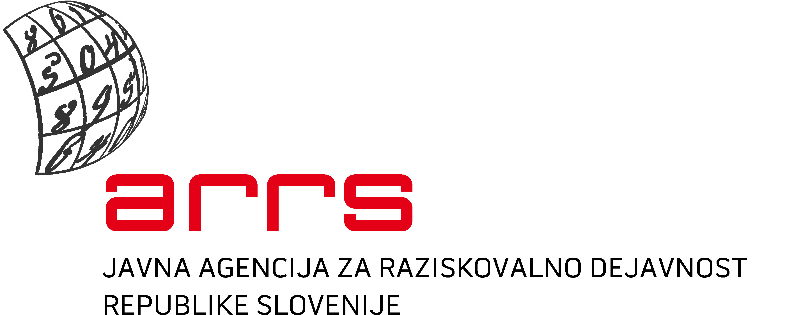

# ChildNet: Structural Kin-based Facial Synthesis Model with Appearance Control Mechanisms

###[IEEE Access](https://ieeexplore.ieee.org/document/10126110)



### Abstract
Kinship face synthesis is an increasingly popular topic within the computer vision
community, particularly the task of predicting the child appearance using parental images. Previous work
has been limited in terms of model capacity and inadequate training data, which comprised of low-resolution
and tightly cropped images, leading to lower synthesis quality. In this paper, we propose ChildNet, a
method for kinship face synthesis that leverages the facial image generation capabilities of a state-of-the-art
Generative Adversarial Network (GAN), and resolves the aforementioned problems. ChildNet is designed
within the GAN latent space and is able to predict a child appearance that bears high resemblance to real
parents’ children. To ensure fine-grained control, we propose an age and gender manipulation module
that allows precise manipulation of the child synthesis result. ChildNet is capable of generating multiple
child images per parent pair input, while providing a way to control the image generation variability.
Additionally, we introduce a mechanism to control the dominant parent image. Finally, to facilitate the
task of kinship face synthesis, we introduce a new kinship dataset, called Next of Kin. This dataset contains
3690 high-resolution face images with a diverse range of ethnicities and ages. We evaluate ChildNet in
comprehensive experiments against three competing kinship face synthesis models, using two kinship
datasets. The experiments demonstrate the superior performance of ChildNet in terms of identity similarity,
while exhibiting high perceptual image quality.

### Model Sketch


### Age, gender control


### Dominant parent control



## Requirements
This repository depends on [E4e](https://github.com/omertov/encoder4editing) and [StyleGAN2](https://github.com/NVlabs/stylegan2-ada-pytorch) repositories. Setting up these repositories requires C++/CUDA compilation, which can sometimes cause issues. 

If experiencing problems, try using [this dockerfile](https://github.com/rosinality/alias-free-gan-pytorch/blob/main/Dockerfile).


## Download Models
`./download.sh`

## Example Usage (Inference)
`python main.py --father imgs/father.jpg --mother imgs/mother.jpg`

The image result (synthesised child) is saved under `imgs/result.jpg`.

We provide two different models: one is trained on Next of Kin dataset (`--model_weights nokdb`) and the other one on Families in the Wild (`--model_weights fiw`).

Control the child's age and gender through `--child_age` and `--child_gender` argument.

Control the dominant parent appearance through `--move2parent` argument.


## Code Acknowledgements
[Encoder for Editing](https://github.com/omertov/encoder4editing) 

[StyleGAN2](https://github.com/NVlabs/stylegan2-ada-pytorch) 


### Sponsor acknowledgements
Supported in parts by the Slovenian Research Agency ARRS through the Research Programme P2-0250(B) Metrology and Biometric System, the ARRS Project J2-2501(A) DeepBeauty and the ARRS junior researcher program.



### Citation

If you find ChildNet useful in your research work, please consider citing:

```bibtex
  @ARTICLE{10126110,
  author={Pernuš, Martin and Bhatnagar, Mansi and Samad, Badr and Singh, Divyanshu and Peer, Peter and Štruc, Vitomir and Dobrišek, Simon},
  journal={IEEE Access}, 
  title={ChildNet: Structural Kinship Face Synthesis Model With Appearance Control Mechanisms}, 
  year={2023},
  volume={},
  number={},
  pages={1-1},
  doi={10.1109/ACCESS.2023.3276877}}
```
